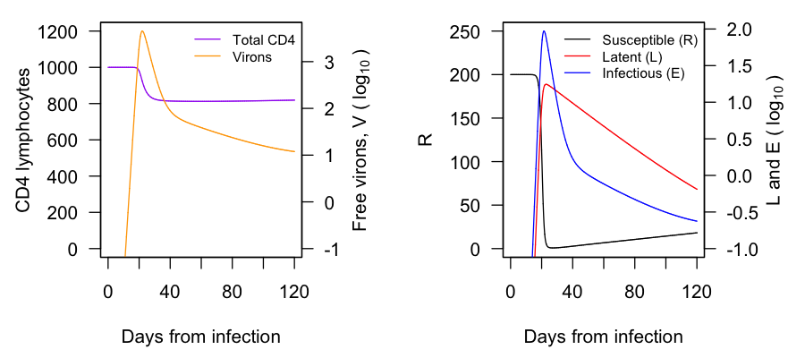
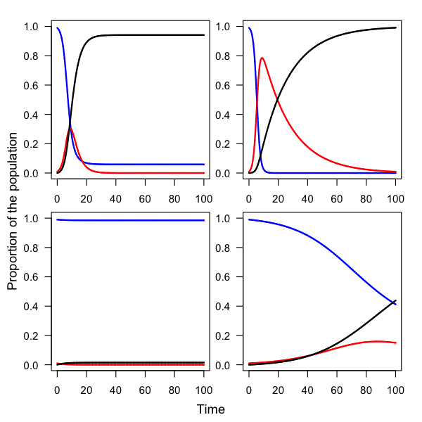
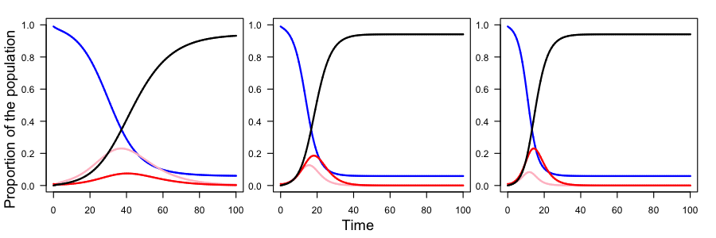

<link rel="stylesheet" href="CS.css">

<br />
<br />

# Key to Problem Set 1: Disease Models in R
Due Monday, 09 March at 5 PM. Submissions may be printed or digital. Printed copies can be given to me during class, or dropped off at the Biology Office (Arey 101), or under my office door (Olin 216).If digital, please send as a .pdf.

1. Otto and Day wrote about applications mathematical modeling in understanding HIV. One paper, by Phillip (1996), used a mathematical model to test a hypothesis and come to a counterintuitive conclusion about the immune systems's role in reducing HIV concentration within infected people. After reading the chapter, learning how to simulate (i.e., solve) a SIR model in R, I asked for you to try to recreate their model. I would like for you to do that in this problem. If you save your `ode()` output to `hiv_out`—like this `hiv_out <- ode(` but continue with the rest of the code that goes in `ode()`—you can paste the code below to recreate their figures more closely (with axes on a log scale, multiple curves per plot, and multiple *y* axes).

	```R
	CD4 <- 1000*(1 - parm_vals["tau"]) + hiv_out[,2] + hiv_out[,3] + hiv_out[,4]
		
	par(mar = c(4.5, 4.5, 1, 4.5), mfrow = c(1, 2))
	plot(x = hiv_out[,1], y = CD4, type = "l", las = 1, xlab = "Days from infection", ylab = "CD4 lymphocytes", ylim = c(0, 1200), col = "purple")
	par(new = T)
	plot(x = hiv_out[,1], y = log(x = hiv_out[,5], base = 10), type = "l", xaxt = "n", yaxt = "n", xlab = "", ylab = "", col = "orange", ylim = c(-1, max(log(x = hiv_out[,5], base = 10))))
		axis(side = 4, las = 1)
		mtext(side = 4, text = bquote("Free virons, V ("~log[10]~")"), line = 2.25)
		legend(x = "topright", bty = "n", col = c("purple", "orange"), lty = 1, legend = c("Total CD4", "Virons"), cex = 0.75)
		
	plot(x = hiv_out[,1], y = hiv_out[,2], type = "l", xlab = "Days from infection", ylab = "R", col = "black", las = 1, ylim = c(0, 250))
	par(new = T)
	plot(x = hiv_out[,1], y = log(x = hiv_out[,3], base = 10), type = "l", xaxt = "n", yaxt = "n", xlab = "", ylab = "", col = "red", ylim = c(-1, max(log(x = c(hiv_out[,3], hiv_out[,4]), base = 10))))
	lines(x = hiv_out[,1], y = log(x = hiv_out[,4], base = 10), col = "blue")
		axis(side = 4, las = 1)
		mtext(side = 4, bquote("L and E ("~log[10]~")"), line = 2.75)
		legend(x = "topright", bty = "n", col = c("black", "red", "blue"), lty = 1, legend = c("Susceptible (R)", "Latent (L)", "Infectious (E)"), cex = 0.75)
```

	---
	Here is the code:

	```r
	library(package = "deSolve")
	
	hiv <- function(time, init, parms) {
		with(as.list(c(init, parms)), {
		dR <- Gamma*tau - mu*R - beta*R*V
		dL <- p*beta*R*V - mu*L - alpha*L
		dE <- (1 - p)*beta*R*V + alpha*L - delta*E
		dV <- pip*E - sigma*V
		return(list(c(dR, dL, dE, dV)))
		})
	}
	
	time_seq <- seq(from = 0, to = 120, by = 0.01)
	init_vals <- c(R = 200, L = 0, E = 0, V = 4e-7)
	parm_vals <- c(Gamma = 1.36, tau = 0.2, mu = 1.36e-3, beta = 0.00027, p = 0.1, alpha = 3.6e-2, sigma = 2, delta = 0.33, pip = 100)
	
	hiv_out <- ode(y = init_vals, times = time_seq, parms = parm_vals, func = hiv)
	CD4 <- 1000*(1 - parm_vals["tau"]) + hiv_out[,2] + hiv_out[,3] + hiv_out[,4]
	```

	And the figure:
	

2. In the SIR model there are two parameters: the transmission rate, *&beta;*, and the recovery rate, *&gamma;*. Bounding these parameters between 0 and 1, please qualitatively describe the four outcomes for the following scenarios:
	- relatively large transmission and large recovery rates
	- relatively large transmission and small recovery rates
	- relatively small transmission and large recovery rates
	- relatively small transmission and small recovery rates

	Also remember that you can change the duration of the simulation. Include a figure of each (4 in total).

	---
	   
	My parameters were $\beta = 0.9$ and $\beta = 0.1$ respectively for hight and low values, and $\gamma = 0.3$ and $\gamma = 0.05$ respectively for hight and low values. Given these values, you can see that large transmission rates (top row) resulted in large and fast epidemics. When trasmission was small (bottom row), epidemics did not happen (left) or were smaller (right). For the arbitrary values that I chose, when transmission was small and recovery was large (bottom left), there was never and epidemic. When they both were large (top left), there was still an epidemic because trasmission was greater than recovery.

3. Please write down a mathematical model of a disease without a recovery phase, where infected individuals, after clearing the pathogen, become susceptible again.

	---
	$$\frac{\mathrm{d}S}{\mathrm{d}t} = -\beta SI + \delta I \\ \frac{\mathrm{d}I}{\mathrm{d}t} = \beta SI - \delta I$$
	Here, $\delta$ is the rate at which individuals recover, only to become susceptible again.

4. With the model from question 3., change the two parameters: the transmission rate, *&beta;*, and the rate at which individuals become susceptible again, *&gamma;*. What are the two qualitative outcomes of this model?

	---
	If the infection is cleared at a greater rate than it is transmitted, then one outcome is that the disease goes extinct leaving us with no infectious. If trasmission is greater than clearing, then there will be an endemic state as a balance between susceptible and infectious subpopulations, but never 100% susceptible.

5. Create a model where the disease has a latent period (i.e,. a SEIR model). Choose parameter values such that you cause an epidemic.
	 - What are your transmission and recovery rates? What is the rate that exposed individuals become infectious?
	 - What are the reciprocals of the recovery rate and the rate that exposed individuals become infectious? These are respectively the average infectious period and average duration of latency.
	 - Next, change the rate that exposed individuals become infectious. Describe how it changes the epidemic.

	---

	- Transmission rate, $\beta = 0.9$; recovery rate, $\gamma = 0.3$; exposed-to-infectious rate, $\zeta = 0.4$.
	- $1/\gamma = 3.\bar{3}$; $1\zeta = 2.5$
	- A large latent period (a small $\zeta$) means that many people are exposed but not yet infectious and ultilately they epidemic is small and long. As the latent period decreases (a large $\zeta$), the epidemic happens faster and is larger. Below descreases the latent period (increasing $\zeta$) with the exposed class in pink:

	

6. Below is some data I acquired for COVID-19: 

	```R
	first_date_I <- as.Date("2020-01-25")
	first_date_R <- as.Date("2020-02-01")
	last_date <- as.Date("2020-02-29")
	infec_seq <- seq(from = first_date_I, to = last_date, by = 1)
	rec_seq <- seq(from = first_date_R, to = last_date, by = 1)
	
	infec <- c(1438, 2118, 2927, 5578, 6165, 8235, 10151, 12281, 16804, 19884, 24027, 27585, 30798, 34485, 37069, 40326, 42696, 44584, 45539, 60627, 66634, 69112, 71194, 73273, 75029, 75634, 77227, 76762, 77612, 80435, 78707, 79665, 82246, 82333, 83574, 85591)
	
	rec <- c(288, 463, 617, 866, 1120, 1507, 2000, 2651, 3313, 3905, 4689, 5279, 6531, 7952, 9477, 10908, 12590, 14315, 16136, 18060, 19258, 22613, 23452, 25128, 27895, 30422, 33555, 36263, 39524)
	
	plot(x = infec_seq, y = infec, pch = 16)
		lines(x = infec_seq, y = infec)
	points(x = rec_seq, y = rec, col = "blue", pch = 16)
		lines(x = rec_seq, y = rec, col = "blue")
	```
Please develop an SEIR model and change the parameter values by hand until you generate a set of curves that, when overlaid on the COVID-19 data, look similar. Please include the figure and the parameter values you used.